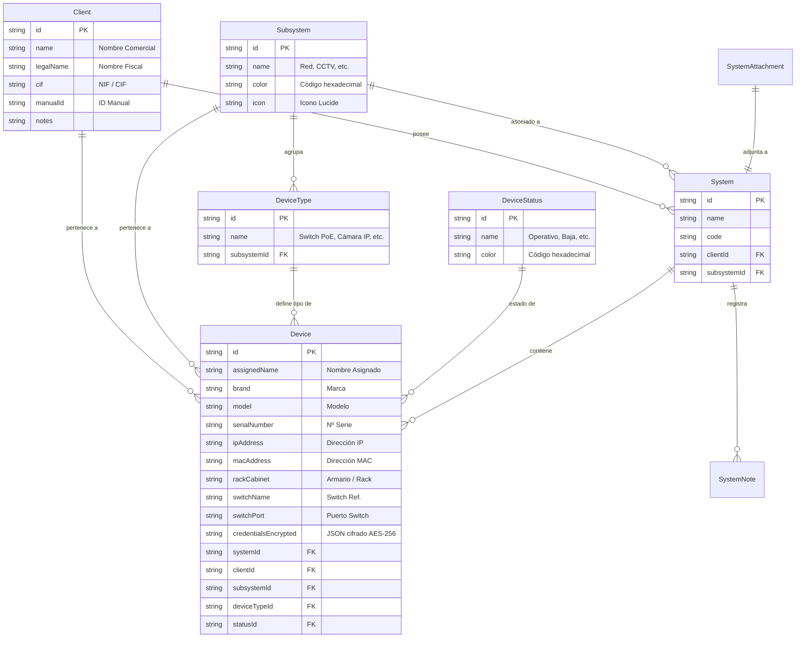

# 📦 Inventario de Dispositivos por Cliente


Plataforma Web integral para el **gestión, auditoría y control de inventario de dispositivos informáticos y sistemas de seguridad** organizados jerárquicamente por Cliente, Sistema y Subsistema técnico (Red, CCTV, Interfonía, Control de Accesos e Intrusión/Alarma).

---

## 📐 1. Arquitectura del Sistema

La solución utiliza una arquitectura desacoplada basada en microservicios contenerizados y orquestados mediante **Docker Compose**:

```
                                 [ Usuario / Navegador Web ]
                                             │
                                     ( Puerto 3000 / HTTP )
                                             ▼
                             ┌─────────────────────────────────┐
                             │    inventario_frontend          │
                             │  (Nginx 1.25 + React 18 SPA)    │
                             └────────────────┬────────────────┘
                                              │ Proxy /api/ & /uploads/
                                              ▼
                             ┌─────────────────────────────────┐
                             │     inventario_backend          │
                             │ (Node.js 20 + Express API REST) │
                             └────────────────┬────────────────┘
                                              │ Prisma ORM (TCP 5432)
                                              ▼
                             ┌─────────────────────────────────┐
                             │    inventario_postgres          │
                             │    (PostgreSQL 15-Alpine)       │
                             └─────────────────────────────────┘
```

### 🔹 Componentes Principales:
* **Frontend SPA (`inventario_frontend`)**: Construido con **React 18**, **TypeScript**, **Vite** y **Lucide Icons**. Cuenta con un sistema de diseño customizado con modo oscuro automático, componentes reutilizables (`CustomSelect`), gráficos interactivos y soporte de exportación/importación masiva en Excel (`xlsx`).
* **Backend API REST (`inventario_backend`)**: Desarrollado en **Node.js 20** con **Express** y **TypeScript**. Incluye autenticación mediante tokens **JWT**, cifrado simétrico **AES-256-GCM** para credenciales de equipos, gestión de adjuntos con **Multer** y documentación interactiva con **Swagger UI**.
* **Base de Datos (`inventario_postgres`)**: Instancia **PostgreSQL 15** gestionada mediante **Prisma ORM**. Garantiza integridad relacional, índices de alto rendimiento y migraciones automatizadas.
* **Orquestación**: Docker Compose con proxy inverso **Nginx** que optimiza la entrega de archivos estáticos y enruta peticiones hacia el API backend.

---

## 🗄️ 2. Modelo de Datos y Entidades

El modelo relacional está diseñado para soportar jerarquías complejas y mantener la integridad de los datos de inventario:



---

## ✨ 3. Características y Funcionalidades Principales

### 🏢 Gestión Multi-Cliente y Multi-Sistema
* Organización jerárquica: **Cliente** ➔ **Sistema** ➔ **Dispositivos**.
* Búsqueda global instantánea por nombre comercial, nombre fiscal, NIF o ID manual.

### 📷 Inventario Técnico Detallado
* Registro completo por equipo: Marca, Modelo, Nº Serie, Dirección IP, Dirección MAC, Armario/Rack, Switch de conexión y Puerto.
* **Estado en Columna Propia**: Visualización con distintivos de color (*Operativo*, *Falta instalación*, *En mantenimiento*, *Baja*).
* **Filtros Avanzados**: Filtrado combinado por Subsistema y por Estado mediante desplegables de diseño personalizado (`CustomSelect`).

### 🔐 Cifrado de Credenciales (AES-256-GCM)
* Permite almacenar múltiples cuentas de acceso por dispositivo (ej: Usuario Administrador, Usuario Operador, Cámara RTSP).
* Cifrado transparente en backend con algoritmo simétrico de grado militar **AES-256-GCM**.

### 📊 Importación y Exportación Masiva en Excel
* **Exportación**: Descarga del inventario filtrado o completo en formato `.xlsx` estructurado.
* **Plantilla e Importación**: Permite cargar masivamente dispositivos mediante archivos Excel con resolución inteligente de Subsistemas, Tipos y Estados.

### 📈 Cuadro de Mando e Informes
* Resumen ejecutivo con métricas totales de Clientes, Sistemas y Dispositivos.
* Desglose visual por porcentaje de inventario según **Subsistemas** y **Estados del Dispositivo**.

### 🛡️ Seguridad e Integridad Relacional
* Protección contra borrado accidental de subsistemas o tipos de dispositivo vinculados a equipos activos.
* Normalización automática de fechas en formato Estándar ISO 8601 (`YYYY-MM-DDTHH:MM:SS.SSSZ`).

---

## ⚙️ 4. Configuración de Variables de Entorno (`.env`)

Las credenciales, secretos y puertos se definen en el archivo `.env` ubicado en la raíz del proyecto.

### 📝 Ejemplo de `.env`:
```env
# ==========================================
# CONFIGURACIÓN DE VARIABLES DE ENTORNO (DOCKER)
# ==========================================

# Base de Datos PostgreSQL
POSTGRES_DB=inventario_db
POSTGRES_USER=postgres
POSTGRES_PASSWORD=postgrespassword
POSTGRES_PORT=5432

# Backend API
BACKEND_PORT=3001
JWT_SECRET=supersecret_jwt_key_inventario_2026
ENCRYPTION_KEY=0123456789abcdef0123456789abcdef0123456789abcdef0123456789abcdef

# Frontend Web
FRONTEND_PORT=3000
```

---

## 🚀 5. Despliegue Rápido con Docker

### Requisitos Previos:
* [Docker Desktop](https://www.docker.com/products/docker-desktop/) (v20+)
* [Docker Compose](https://docs.docker.com/compose/) (v2.0+)

### Pasos de Despliegue:

1. **Clonar el repositorio**:
   ```bash
   git clone https://github.com/nbcloud97/0001_INVENTARIO_DISPOSITIVOS.git
   cd 0001_INVENTARIO_DISPOSITIVOS
   ```

2. **Crear archivo de configuración de entorno**:
   ```bash
   cp .env.example .env
   ```

3. **Construir y levantar la pila de contenedores**:
   ```bash
   docker compose up -d --build
   ```

4. **Acceder a la aplicación**:
   * **Aplicación Web (Frontend)**: [http://localhost:3000](http://localhost:3000)
   * **API Backend REST**: [http://localhost:3001/health](http://localhost:3001/health)
   * **Documentación Swagger API**: [http://localhost:3001/api/docs](http://localhost:3001/api/docs)

5. **Credenciales por defecto**:
   * **Usuario:** `admin`
   * **Contraseña:** `admin123`

---

## 📚 6. Documentación de la API REST (Swagger)

El Backend expone una API REST interactiva documentada bajo OpenAPI / Swagger.

### Endpoints Principales (`/api/v1`):

| Método | Endpoint | Descripción |
| :--- | :--- | :--- |
| `POST` | `/api/v1/auth/login` | Autenticación y obtención de Token JWT |
| `GET` | `/api/v1/clients` | Obtener listado de clientes registrados |
| `POST` | `/api/v1/clients` | Registrar un nuevo cliente |
| `GET` | `/api/v1/systems` | Listado de sistemas por cliente o subsistema |
| `GET` | `/api/v1/devices` | Inventario completo de dispositivos filtrado |
| `POST` | `/api/v1/devices` | Registrar nuevo dispositivo en un sistema |
| `POST` | `/api/v1/devices/import` | Importación masiva desde archivo Excel |
| `GET` | `/api/v1/subsystems` | Listado de subsistemas de seguridad |
| `GET` | `/api/v1/device-statuses` | Listado de estados de dispositivo |

---

## 💻 7. Desarrollo Local (Sin Docker)

Si deseas ejecutar los proyectos individualmente sin Docker:

### Requisitos:
* **Node.js**: v20+
* **PostgreSQL**: Instancia local o remota en puerto 5432.

### Configuración Backend:
```bash
cd backend
npm install
# Crear archivo backend/.env con DATABASE_URL, JWT_SECRET y ENCRYPTION_KEY
npx prisma db push
npm run db:seed
npm run dev
```

### Configuración Frontend:
```bash
cd frontend
npm install
npm run dev
```

---

## 📄 8. Licencia

Este proyecto está bajo la Licencia **MIT**. Libre para uso, modificación y distribución.
