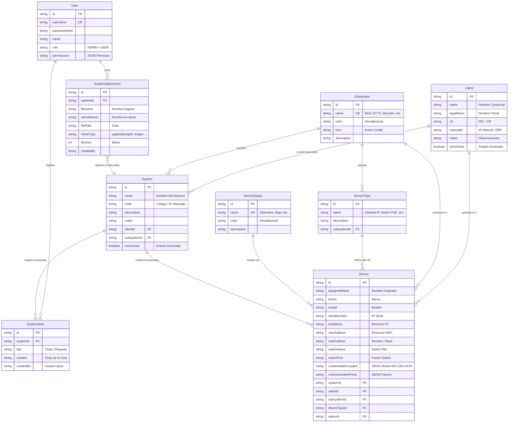

# 📦 Inventario de Dispositivos por Cliente


Plataforma Web integral para la **gestión, auditoría y control de inventario de dispositivos informáticos y sistemas de seguridad** organizados jerárquicamente por Cliente, Sistema y Subsistema técnico (Red, CCTV, Interfonía, Control de Accesos e Intrusión/Alarma), con integración directa a **Oracle ERP Beta 10**, archivado en cascada, gestión de archivos adjuntos, notas técnicas y copias de seguridad.

---

## 📐 1. Arquitectura del Sistema

La solución utiliza una arquitectura desacoplada basada en microservicios contenerizados y orquestados mediante **Docker Compose**:

```
                                  [ Usuario / Navegador Web ]
                                              │
                                      ( Puerto 3000 / HTTP )
                                              ▼
                              ┌─────────────────────────────────┐
                              │    inventario_frontend          │
                              │  (Nginx 1.25 + React 18 SPA)    │
                              └────────────────┬────────────────┘
                                               │ Proxy /api/ & /uploads/
                                               ▼
                              ┌─────────────────────────────────┐       (Conexión TCP / 1521)
                              │     inventario_backend          │ ───────────────────────────────► ┌──────────────────────────┐
                              │ (Node.js 20 + Express API REST) │                                  │  Oracle ERP Beta 10      │
                              └────────────────┬────────────────┘                                  │  (Consulta / Importación)│
                                               │ Prisma ORM (TCP 5432)                             └──────────────────────────┘
                                               ▼
                              ┌─────────────────────────────────┐
                              │    inventario_postgres          │
                              │    (PostgreSQL 15-Alpine)       │
                              └─────────────────────────────────┘
```

### 🔹 Componentes Principales:
* **Frontend SPA (`inventario_frontend`)**: Desarrollado en **React 18**, **TypeScript**, **Vite** y **Tailwind / Lucide Icons**. Incluye interfaz adaptativa con modo oscuro automático, componentes reutilizables (`CustomSelect`), pestañas de filtrado de estado (Activos / Archivados / Todos), visor/descarga de adjuntos, modales de importación y asistentes de lote.
* **Backend API REST (`inventario_backend`)**: Desarrollado en **Node.js 20** con **Express** y **TypeScript**. Incorpora autenticación mediante **JWT**, control de permisos, cifrado **AES-256-GCM** para credenciales de equipos, subida de archivos multipart con **Multer**, conector **OracleDB** (`oracledb`) para ERP Beta 10, motor de copias de seguridad y documentación interactiva con **Swagger UI**.
* **Base de Datos (`inventario_postgres`)**: Instancia de **PostgreSQL 15** gestionada mediante **Prisma ORM**. Maneja integridad referencial en cascada, índices optimizados y persistencia volumétrica.
* **Integración Externa (ERP Beta 10)**: Conector de solo lectura contra bases de datos Oracle para sincronización e importación masiva de Clientes y Sistemas.
* **Orquestación & Autoarranque**: Configuración en **Docker Compose** con proxy inverso Nginx y scripts de inicio desasistido para Windows Task Scheduler.

---

## 🗄️ 2. Modelo de Datos y Entidades

El modelo relacional en Prisma soporta jerarquías organizativas completas, archivado en cascada, gestión documental y credenciales cifradas:



---

## ✨ 3. Características y Funcionalidades Principales

### 🏢 Gestión de Clientes y Sistemas con Archivado Inteligente
* Organización jerárquica: **Cliente** ➔ **Sistemas** ➔ **Dispositivos**.
* **Archivado en Cascada**: Al archivar un cliente, todos sus sistemas asociados se archivan automáticamente dentro de una transacción en base de datos. Al desarchivar el cliente, se recuperan todos sus sistemas.
* **Pestañas de Filtrado**: Selector rápido para conmutar entre registros `Activos`, `Archivados` o `Todos` con contadores en tiempo real.
* Búsqueda global instantánea por nombre comercial, razón social, NIF o ID de cliente.

### 🔌 Integración Directa con Oracle ERP Beta 10
* Conector de base de datos Oracle para consultar el ERP empresarial en tiempo real.
* Búsqueda unificada de clientes por nombre, razón social, CIF o ID en Beta 10.
* **Importación en 1 Clic**: Importa el cliente y sus sistemas técnicos registrados (CCTV, Intrusión, Incendio, Control de accesos) mapeándolos automáticamente a la estructura del inventario.

### 📷 Inventario Técnico Detallado de Dispositivos
* Ficha técnica completa por equipo: Marca, Modelo, Nº de Serie, Dirección IP, Dirección MAC, Armario/Rack, Switch de conexión y Puerto de red.
* **Estados y Distintivos**: Colores configurables (*Operativo*, *Falta instalación*, *En mantenimiento*, *Baja*).
* **Filtros Avanzados**: Desplegables customizados (`CustomSelect`) con búsqueda integrada por Subsistema y Estado.

### 📝 Notas Técnicas y Archivos Adjuntos por Sistema
* **Bitácora de Notas**: Registro de observaciones técnicas, cambios de configuración e incidencias por sistema con autoría y fecha.
* **Gestor Documental**: Carga de planos, esquemas de red, manuales en PDF e imágenes con previsualización directa y descarga.

### 🔐 Bóveda de Credenciales Cifradas (AES-256-GCM)
* Almacenamiento seguro de múltiples cuentas de acceso por dispositivo (Administrador, Operador, RTSP, etc.).
* Cifrado en reposo simétrico con vector de inicialización (IV) único y verificación de integridad (GCM Tag).

### 📊 Importación y Exportación Masiva en Excel
* **Plantilla Estructurada**: Descarga de plantilla `.xlsx` con 17 columnas alineadas y hoja adicional `"Guía de Campos"` con descripciones y ejemplos para CCTV, Red, Intrusión, Accesos e Interfonía.
* **Resolución Inteligente**: El importador realiza normalización sin distinción de mayúsculas, minúsculas, tildes o términos parciales para asignar automáticamente Subsistemas, Tipos y Estados existentes.

### 💾 Copias de Seguridad y Restauración
* Generación y exportación de backups integrales de la base de datos en formato JSON descargable.
* Asistente de restauración directa desde la interfaz para recuperación ante desastres.

### 👥 Gestión de Usuarios y Permisos
* Control de acceso mediante tokens JWT con expiración configurable.
* Roles de usuario (`ADMIN` / `USER`) con panel de administración de cuentas y contraseñas.

---

## ⚙️ 4. Configuración de Variables de Entorno (`.env`)

Crea un archivo `.env` en la raíz del proyecto tomando como base `.env.example`:

```env
# ==========================================
# CONFIGURACIÓN DE VARIABLES DE ENTORNO (DOCKER)
# Inventario de Dispositivos por Cliente
# ==========================================

# Credenciales y Configuración de PostgreSQL
POSTGRES_DB=inventario_db
POSTGRES_USER=postgres
POSTGRES_PASSWORD=postgrespassword
POSTGRES_PORT=5432

# Configuración y Secretos de Backend API
BACKEND_PORT=3001
JWT_SECRET=supersecret_jwt_key_inventario_2026
ENCRYPTION_KEY=0123456789abcdef0123456789abcdef0123456789abcdef0123456789abcdef

# Puerto de la Aplicación Frontend Web
FRONTEND_PORT=3000

# Conexión Oracle ERP Beta 10
ORACLE_HOST=172.16.90.20
ORACLE_PORT=1521
ORACLE_SERVICE_NAME=BETA10
ORACLE_USER=satya_only_reader
ORACLE_PASSWORD=tu_password_oracle
```

---

## 🚀 5. Despliegue con Docker Compose

### Requisitos Previos:
* [Docker Desktop](https://www.docker.com/products/docker-desktop/) (v20+) o Docker Engine con Docker Compose v2.

### Pasos de Puesta en Marcha:

1. **Clonar el repositorio**:
   ```bash
   git clone https://github.com/nbcloud97/0001_INVENTARIO_DISPOSITIVOS.git
   cd 0001_INVENTARIO_DISPOSITIVOS
   ```

2. **Configurar el entorno**:
   ```bash
   cp .env.example .env
   # Editar .env con los secretos y credenciales deseadas
   ```

3. **Construir y arrancar los contenedores**:
   ```bash
   docker compose up -d --build
   ```

4. **Acceso a la plataforma**:
   * **Aplicación Web**: [http://localhost:3000](http://localhost:3000)
   * **API Backend**: [http://localhost:3001/health](http://localhost:3001/health)
   * **Documentación Swagger API**: [http://localhost:3001/api/docs](http://localhost:3001/api/docs)

5. **Credenciales iniciales**:
   * **Usuario:** `admin`
   * **Contraseña:** `admin123`

---

## 🖥️ 6. Configuración de Autoarranque en Windows

El proyecto incluye scripts automatizados para programar el inicio de los contenedores Docker automáticamente al encender el equipo Windows (como servicio de sistema desasistido sin necesidad de login previo):

1. Hacer clic derecho sobre `INSTALAR_AUTOARRANQUE_WINDOWS.bat`.
2. Seleccionar **Ejecutar como administrador**.
3. El script creará la tarea programada `Inventario_AutoStart_OnBoot` en el Programador de Tareas de Windows vinculada a `scripts/run_docker_compose.bat`.

---

## 📚 7. Catálogo de Endpoints de la API REST

La API se documenta interactivamente en `/api/docs`. A continuación se resume la tabla de endpoints principales:

| Módulo | Método | Endpoint | Descripción |
| :--- | :--- | :--- | :--- |
| **Auth** | `POST` | `/api/v1/auth/login` | Iniciar sesión y obtener token JWT |
| | `GET` | `/api/v1/auth/me` | Verificar identidad del token activo |
| **Clientes** | `GET` | `/api/v1/clients` | Listar clientes (soporta filtros `search` e `isArchived`) |
| | `POST` | `/api/v1/clients` | Registrar un nuevo cliente |
| | `PUT` | `/api/v1/clients/:id` | Actualizar cliente / archivar (cascada a sistemas) |
| | `DELETE` | `/api/v1/clients/:id` | Eliminar cliente y sus dependencias |
| **Sistemas** | `GET` | `/api/v1/systems` | Listar sistemas con conteo de dispositivos |
| | `POST` | `/api/v1/systems` | Crear sistema vinculado a cliente y subsistema |
| | `PUT` | `/api/v1/systems/:id` | Modificar sistema o alternar archivado |
| | `DELETE` | `/api/v1/systems/:id` | Eliminar sistema |
| **Notas** | `GET` | `/api/v1/systems/:systemId/notes` | Obtener notas técnicas de un sistema |
| | `POST` | `/api/v1/systems/notes` | Añadir nueva nota a un sistema |
| | `DELETE` | `/api/v1/systems/notes/:id` | Eliminar nota técnica |
| **Adjuntos** | `GET` | `/api/v1/systems/:systemId/attachments` | Listar adjuntos de un sistema |
| | `POST` | `/api/v1/systems/attachments` | Subir archivo adjunto (Multipart) |
| | `GET` | `/api/v1/systems/attachments/:id/download` | Descargar archivo adjunto |
| | `GET` | `/api/v1/systems/attachments/:id/preview` | Previsualizar adjunto (PDF / Imagen) |
| | `DELETE` | `/api/v1/systems/attachments/:id` | Borrar archivo adjunto |
| **Dispositivos** | `GET` | `/api/v1/devices` | Consultar dispositivos filtrados |
| | `POST` | `/api/v1/devices` | Crear dispositivo individual |
| | `POST` | `/api/v1/devices/bulk` | Creación secuencial en lote (Asistente) |
| | `POST` | `/api/v1/devices/import` | Importación masiva desde archivo Excel |
| | `GET` | `/api/v1/devices/:id/credentials` | Obtener credenciales descifradas (AES-256) |
| | `PUT` | `/api/v1/devices/:id` | Actualizar datos del dispositivo |
| | `DELETE` | `/api/v1/devices/:id` | Eliminar dispositivo |
| **Subsistemas** | `GET` | `/api/v1/subsystems` | Listado de subsistemas de seguridad |
| | `POST` | `/api/v1/subsystems` | Crear nuevo subsistema |
| **Tipos** | `GET` | `/api/v1/device-types` | Catálogo de tipos de equipo |
| | `POST` | `/api/v1/device-types` | Registrar tipo de equipo en subsistema |
| **Estados** | `GET` | `/api/v1/device-statuses` | Listado de estados de equipo |
| | `POST` | `/api/v1/device-statuses` | Crear nuevo estado con color |
| **Beta 10** | `GET` | `/api/v1/beta10/search` | Buscar clientes en base de datos Oracle ERP |
| | `GET` | `/api/v1/beta10/clients/:idcliente/systems` | Obtener sistemas del cliente en Beta 10 |
| | `POST` | `/api/v1/beta10/import` | Importar cliente y sistemas seleccionados |
| **Backups** | `GET` | `/api/v1/backup/stats` | Estadísticas del almacén de datos |
| | `GET` | `/api/v1/backup/export` | Generar y descargar archivo de copia de seguridad |
| | `POST` | `/api/v1/backup/restore` | Restaurar base de datos desde archivo JSON |
| **Usuarios** | `GET` | `/api/v1/users` | Listado de usuarios del sistema |
| | `POST` | `/api/v1/users` | Crear usuario con rol y permisos |
| | `PUT` | `/api/v1/users/:id` | Modificar usuario o actualizar contraseña |
| | `DELETE` | `/api/v1/users/:id` | Eliminar usuario |

---

## 💻 8. Desarrollo Local (Sin Docker)

```bash
# 1. Configuración de Backend
cd backend
npm install
# Asegurar DATABASE_URL en backend/.env
npx prisma db push
npm run db:seed
npm run dev

# 2. Configuración de Frontend
cd ../frontend
npm install
npm run dev
```

---

## 📄 9. Licencia

Este proyecto está bajo la Licencia **MIT**. Libre para uso, modificación y distribución empresarial.
